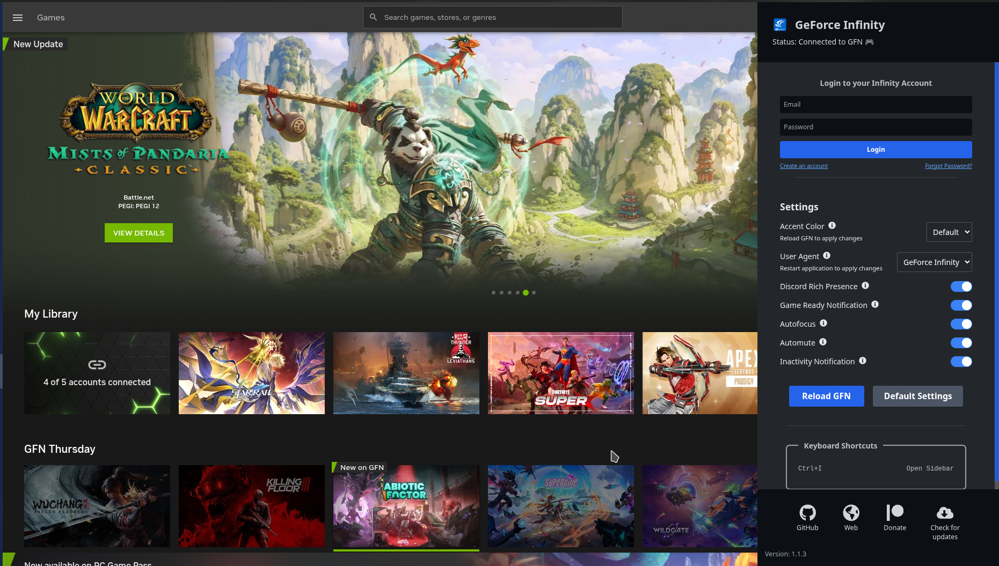
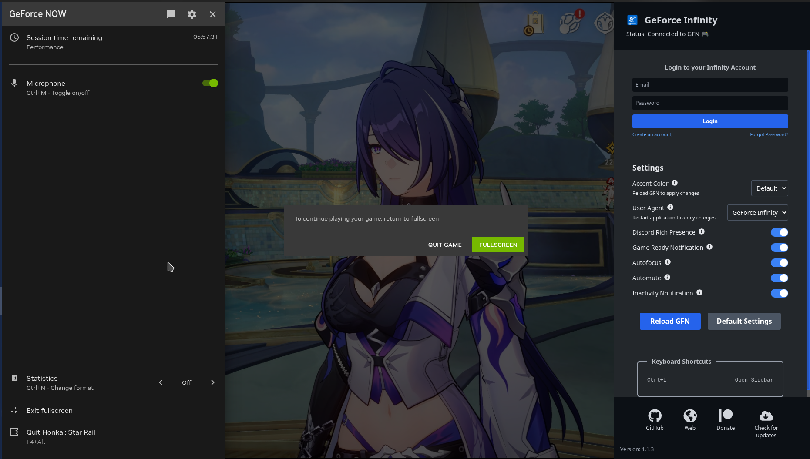

# GeForce Infinity

<p align="center">
  
</p>

**GeForce Infinity** is next-gen application designed to enhance the GeForce NOW experience. Originally created to address the lack of native GeForce NOW support on Linux, this app also provides functionality for macOS and Windows users. Our goal is to refine the user interface and offer custom features for an improved experience.

## **Screenshots**



<p align="center">
  
  
</p>

## 🚀 **Features**

- **Account system:** Users can now register and log in. After logging in, they are able to sync settings to and from the cloud.
- **User dropdown menu in the header.**
- **Inactivity notification:** Alerts you when you're about to be kicked due to inactivity.
- **Automute:** Mutes the game when the window is not in focus.
- **"Anti-kick" feature.** **⚠️Disclaimer:** This is not a real anti-kick. It does not prevent kicks and may violate NVIDIA's TOS. It simply alt-tabs you back into the game if you're unfocused. (both autofocus and inactivity notifications must be enabled)
- **Button to reset all settings to their default values.**
- **Support for smaller screens:** added scrollable areas.
- **Info tooltips added in the settings section.**
- **Enhanced UI**: GeForce Infinity aims to improve the user interface of GeForce NOW, providing a more intuitive and enjoyable experience.
- **Custom Discord Rich Presence**: Show off your gaming status with personalized Discord Rich Presence. Display game details and status updates directly in your Discord profile.
- **Instant App Switch**: Automatically switch to GeForce Infinity once your gaming rig is ready for action!
- **Notifications**: Get notified once your gaming rig is ready for action!

## 🛠️ **Planned Features**

We have several exciting features planned to further enhance your experience:

- **Higher resolution support**
- **Higher FPS support**
- **HDR support**
- **Surround sound support**
- **Ability to open sidebar during gameplay**
- **Game Icon in Discord RPC**: Display a small icon representing the game you’re playing in Discord Rich Presence.
- **Account Switching**: Easily switch between different GeForce NOW accounts within the app.
- **Automatic Game Startup**: Customize which game starts automatically when the app launches.

## ⚠️ **Disclaimer**

GeForce Infinity is an independent project and is not affiliated with, sponsored by, or endorsed by Nvidia or GeForce NOW. All trademarks and logos used are the property of their respective owners. The app is provided as-is, and the developers are not responsible for any issues or damages that may arise from its use.

## 📦 **Installation**

Visit our [Release](https://github.com/AstralVixen/GeForce-Infinity/releases) page, where you can find newest builds of GeForce Infinity in packages like: **zip** (binary version), **deb**, **AppImage**, **rpm** and **exe**.

We also provide installation via **Flatpak** (hosted at Flathub) and **AUR**.

[](https://aur.archlinux.org/packages?O=0&K=geforce-infinity) [](https://flathub.org/apps/io.github.astralvixen.geforce-infinity)

## 🎮 **Usage**

Press `Ctrl+I` to open sidebar to access GeForce Infinity features.

## 🛠️ **Build**

To get started with GeForce Infinity, follow these steps:

1. Clone the repository:

    ```bash
    git clone https://github.com/AstralVixen/GeForce-Infinity.git
    ```

2. Navigate to the project directory:

    ```bash
    cd GeForce-Infinity
    ```

3. Install dependencies:

    ```bash
    yarn install
    ```

4. Run the application:
    ```bash
    yarn start
    ```

## 💬 **Contributing**

We welcome contributions from the community! For the contribution guide please see: [Contributing](CONTRIBUTING.md)

## 📜 **License**

GeForce Infinity is licensed under the [MIT License](LICENSE). See the [LICENSE](LICENSE) file for more details.

## 📫 **Contact**

For questions, feedback, or suggestions, feel free to reach out to me:

- [GitHub Issues](https://github.com/AstralVixen/GeForce-Infinity/issues)
- Email: [astral.vixen.hu@gmail.com](mailto:astral.vixen.hu@gmail.com)
- Discord: [Join my discord](https://discord.gg/p5vRgQwZ9K)
